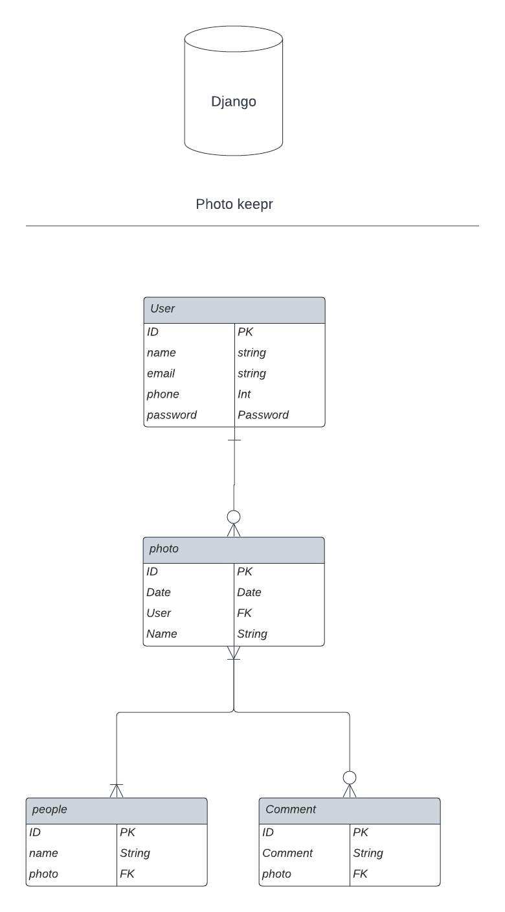
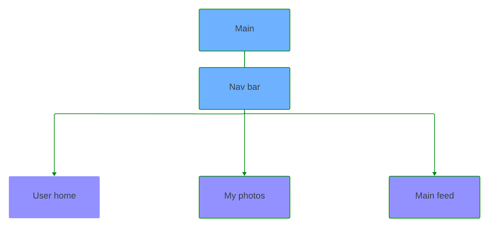
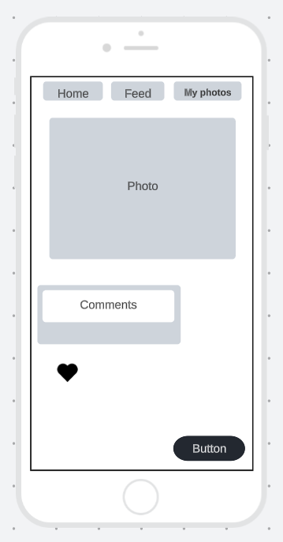

# Photo Keepr
### About
**Photo Keepr** is a web application that allows friends and family to communicate with eachother in small groups. The application is built around photos that friends an family may want to share with one another or just have a place to store these Images off the very constricting space of their phone. In the application you can store photos, share photos with one another and leave messages/comments about the photo. This will be a safe space to store your most valuable memories and have the security to only let the people you want to see it have access. Your data is not stolen or borrowed here in photo keepr so unlike big tech we will not use your data for profit.
### Building blocks of Photo Keepr
1. ### ERD 

2. ### Component Hierarchy Diagram 

3. ### Wireframe

[Linkedin Profile](www.linkedin.com/in/sagemaddux)